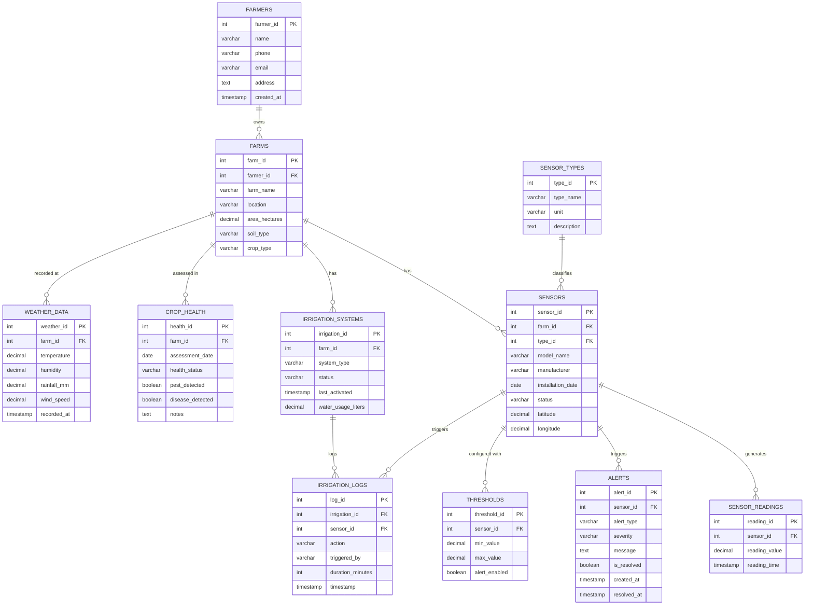

# Smart Agriculture Sensor Database - ER Diagram

## Relationships Summary

| Relationship | Type | Description |
|---|---|---|
| Farmers → Farms | 1:N | one farmer can own multiple farms |
| Farms → Sensors | 1:N | one farm can have multiple sensors |
| Sensor_Types → Sensors | 1:N | each sensor has one type |
| Sensors → Sensor_Readings | 1:N | each sensor spits out many readings |
| Sensors → Alerts | 1:N | sensors can trigger multiple alerts |
| Sensors → Thresholds | 1:N | each sensor can have threshold configs |
| Farms → Irrigation_Systems | 1:N | one farm can have irrigation setups |
| Irrigation_Systems → Irrigation_Logs | 1:N | logs for each irrigation action |
| Sensors → Irrigation_Logs | 1:N | sensors can trigger irrigation |
| Farms → Crop_Health | 1:N | multiple health assessments per farm |
| Farms → Weather_Data | 1:N | weather recorded over time per farm |
